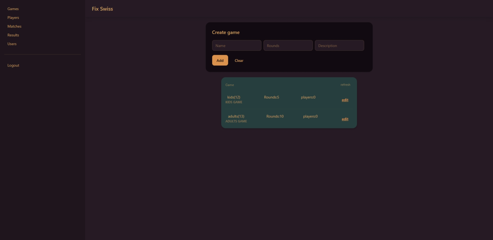
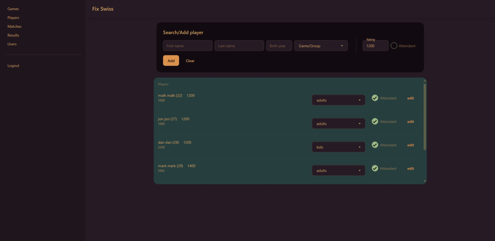
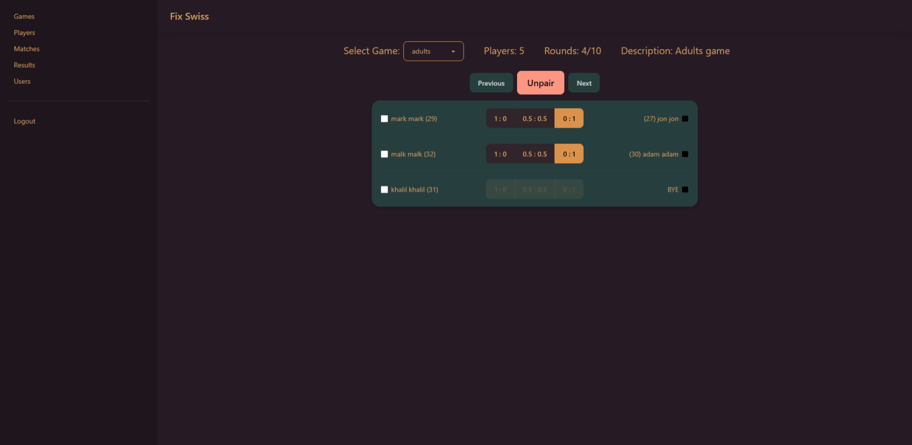
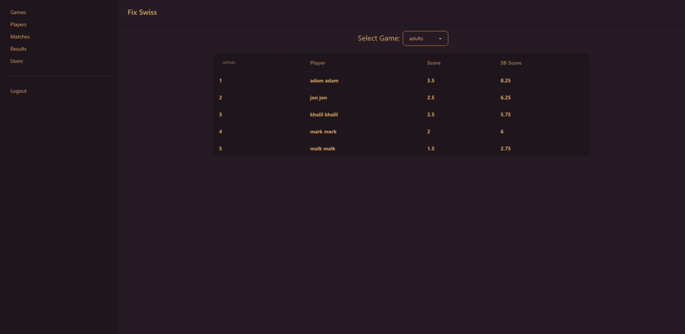

# Fix-Swiss ♟️(Alpha)

**Next.js chess tournament manager with Swiss pairing and SQLite database**






## 🚀 Features

- **Tournament Creation**: Start new tournaments with custom rounds
- **Player Management**: Add/edit players with ratings
- **Attendance Tracking**: Mark present/absent players per round
- **Auto-Pairing**: Swiss-system match generation each round
- **Result Processing**: Record wins/losses/draws with score calculation

## 📅 Upcoming Features

- **Judge Accounts**: Dedicated user roles for match officials
- **Mobile Result Entry**: Judges can submit match results directly from their phones

## 🛠️ Stack

- **Frontend**: Next.js
- **Styling**: Tailwind CSS + DaisyUI
- **Database**: SQLite (via Prisma ORM)
- **Auth**: Custom (Session based)

## 📥 Installation

First run

```bash
git clone https://github.com/khalil212002/fix-swiss.git
cd fix-swiss
npm install
```

Create `.env` file at the project root dir
.env

```
DATABASE_URL="file:./database.db"
HMAC_SALT= // set to some random string
TOTP_SECRET = //set to some random string
```

Update the admin **password** in `prims/seed.ts` file\
And run:

```bash
npx prisma generate
npx prisma migrate dev
npm run dev
```
